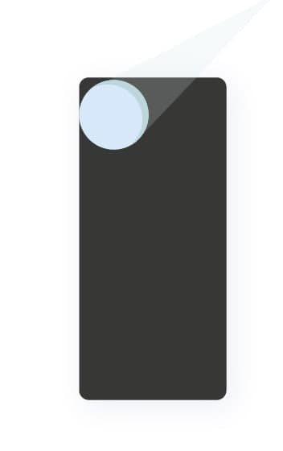
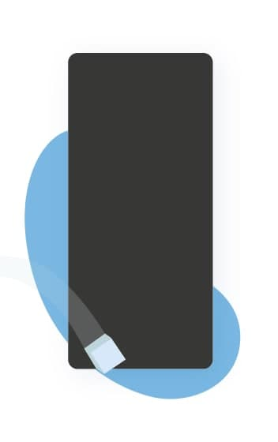

<!DOCTYPE html>
<html>
<head>

</head>

<body>

This grid layout contains four columns and åtta rows:

  	

		

			<h2>Voodoo</h2>
		

		
	
			<h1> 
				Hey guys, 
			</h1>
		

		

	

	

			
			<article>
				This week we’ll be discussing the concept of <strong>"Youtubability"</strong>- 				 
			</article>
			<article>
    			another important game guideline. 
			</article>
		
	

  	

		

		
			<h2 class="p2">
    				Youtubability
			</h2>
			
			
				

    				A key driver of youtubability is <strong>the clarity of your gameplay 				</strong>to a potential player.
				

				

				Gameplay clarity will help you achieve the full potential of your 		game by working on getting <strong>the lowest possible CPIs </strong>for your games.
			

			

				Many elements can be used to make your game clearer :
			

			
	
				For instance, ask yourself if a user’s interaction with the game is 						<strong>evident</strong>, for example, can she tell which character she 					<strong>controls</strong>? Is the <strong>objective clear?</strong> Does it
    				look <strong>fun to play?</strong> Has she understood the game after 1 second 					(great!) or after 10 seconds (too long!).
			

			

				Make sure to <strong>use colours</strong> to help indicate the gameplay rules. 				For instance, in Helix Jump, obstacles are <strong>clearly contrasted</strong> 				(in orange here) and instantly recognized as a threat.
			
			

		
		

		
	

  	

  
	
	
		<nav class="svart">
			Mitten1
			

    				<iframe width="420" height="315" src="bilder/video_comp.mp4" frameborder="0" allowfullscreen></iframe>
			

			
		</nav>
	
 
	

	

		
 
			
 
			If you want to run user tests with friends and family or even random
			people in the street, it is interesting to show them the 30 second video before
			making them try to prototype in order to <strong>understand their 						</strong>expectations from the video vs. the actual game they try.
			

			
	
			<strong>Make it obvious </strong> with visual elements that help <strong>understand 				the objective and controls </strong> of the game, like with the target used in 					Viatcheslav Tarasov’s Purple Diver or Fabrika Games’ Draw Car with the space dedicated 			to drawing.
			

			
		

		
	
 

  
	

			
	
			People will be watching the gameplay videos of your games <strong>on their
			phone’s Facebook feed</strong>, everything will seem smaller than when displayed in 			Unity or as a video on your computer screen. <strong>You should also consider whether 			your gameplay video is understandable if someone watches it on a smallscreen.</strong>  With 			an average watch time of 3 to 5 seconds, this is an <strong>accelerated elevator 			pitch!</strong>
			

			

			Think of the moment when you decide to click on a random video on YouTube just because 			it has an attractive thumbnail - it’s the same idea for your game videos.
			

			
	

	

			<h1></h1>
			
			
		

    			<h1 style="font-size:50px">Tip of the week</h1>
    			

				Livestreams we hold every two weeks are an interesting resource for you
				to consult. There are plenty of relevant subjects covered to guide and
				orient you towards best practices and they are <strong>all replayable on the
				dashboard </strong>so don’t hesitate to check them out!
			

    
  		

	

  	

		
		
  
			<h2> Livestream </h2>
			

			The next publishing livestream will
        		be held this Thursday (7th November)at 3pm CET (Paris time).
			

			
 
        			You’ll receive a reminder e-mail tomorrow.
			
			

			
 
        			You’ll receive a reminder e-mail tomorrow.
			

		

	

	

		

			
			
 <em>We look forward to seeing</em>

			
 <em>your next prototype!</em>

			
			
 	
			<em>The Publishing team</em>
			

    			
 	
			<em>The Publishing team</em>
			

		
		

		
	

</body>
</html>
